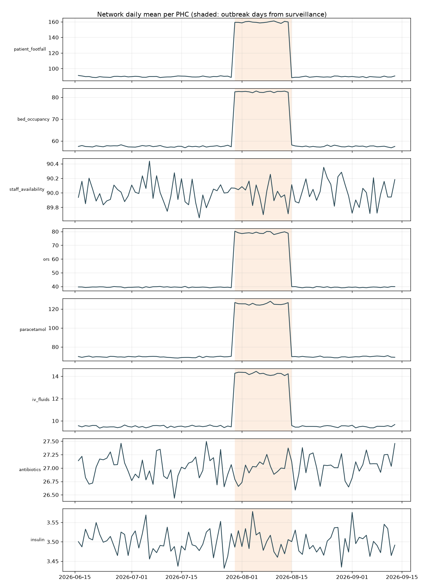
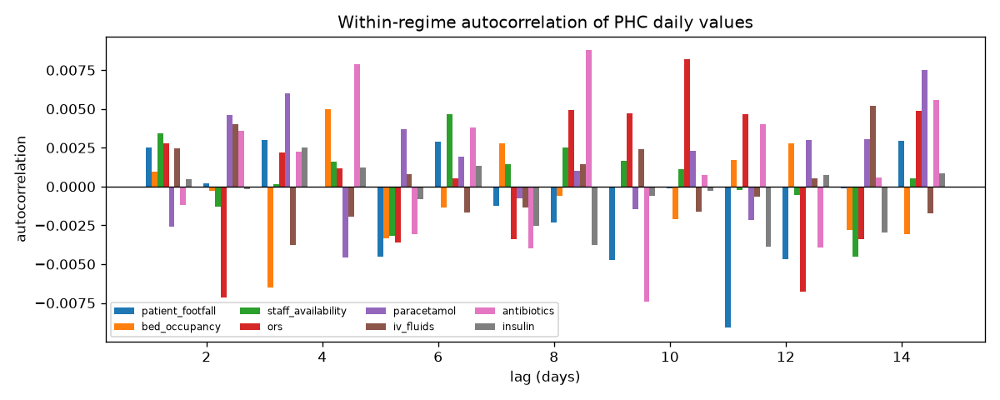
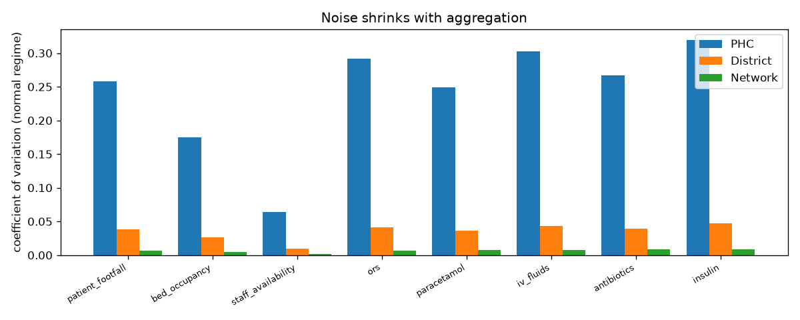
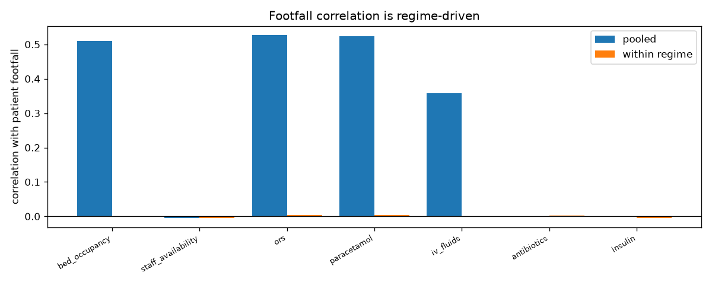
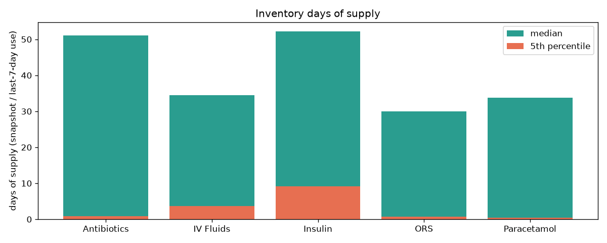

# SENETRA exploratory data analysis

Generated from the operational database (2026-06-16 to 2026-09-13, 90 days). Only aggregate statistics appear here; no rows were exported.

## Modelling implications

- Within a regime, daily values of patient_footfall, bed_occupancy, staff_availability, ors, paracetamol, iv_fluids, antibiotics, insulin behave like independent noise (max |ACF| < 0.05 up to lag 14). Lag features add little, accuracy is bounded by irreducible noise, so evaluation reports skill against naive baselines and a non-deployable noise floor.
- Outbreak regime multiplies demand: patient_footfall x1.78, bed_occupancy x1.44, ors x2.00, paracetamol x1.80, iv_fluids x1.50. A log-link (multiplicative) model with a scenario covariate for outbreak intensity fits this shape.
- staff_availability, antibiotics, insulin show no outbreak response (<5%); forecasts reduce to a stable mean and threshold-based risk rules are sufficient.
- Aggregating PHCs to districts cuts relative noise to 15% of PHC level (median across targets), so district and higher forecasts are far more precise than single-PHC ones.
- No day-of-week pattern (<2% range); calendar features stay in the model but should carry ~zero weight.
- Footfall correlates with bed_occupancy, ors, paracetamol, iv_fluids only through the shared outbreak regime (high pooled, ~0 within-regime correlation): footfall is a regime indicator, not a per-PHC driver.
- Only 0.6% of opening stocks match the previous closing stock; stock-out risk must use the inventory snapshot plus forecasts, not the historical ledger.
- Active simulation_events show no footfall effect in their districts (ratio 1.00); they are used as scenario inputs, never as training labels.
- Only 1 country has PHC data; the country and world federation tiers are exercised with a single member until more countries onboard.
- District/PHC coordinates are missing, so distance-based features and transfer costs are unavailable.
- History holds 1 outbreak episode(s): the outbreak effect is estimated from one episode, and the cold-start backtest fold measures performance before any outbreak is seen.
- 4.5% of rows disagree between outbreak_flag and outbreak_type; features use the flag only.

## Data inventory

| table | rows |
|---|---:|
| countries | 10 |
| states | 22 |
| districts | 105 |
| phcs | 1,339 |
| medicines | 5 |
| daily_metrics | 120,510 |
| medicine_consumption | 602,550 |
| inventory | 6,695 |
| predictions | 0 |
| alerts | 0 |
| simulation_events | 20 |

## Geography and federation coverage

1,339 PHCs in 26 districts across 1 state(s) and 1 country(ies). PHCs per district: min 27, median 49, max 80. 105 of 105 districts and 1,339 PHCs lack coordinates.

| country | states | districts | PHCs |
|---|---:|---:|---:|
| India | 4 | 105 | 1339 |
| Brazil | 2 | 0 | 0 |
| Russia | 2 | 0 | 0 |
| China | 2 | 0 | 0 |
| South Africa | 2 | 0 | 0 |
| Egypt | 2 | 0 | 0 |
| Ethiopia | 2 | 0 | 0 |
| Iran | 2 | 0 | 0 |
| United Arab Emirates | 2 | 0 | 0 |
| Indonesia | 2 | 0 | 0 |

Static PHC attributes (distinct values): total_beds=1, total_doctors=1, total_nurses=1, icu_beds=1, oxygen_beds=1, ambulances=3, cold_storage_capacity=150.

## Outbreak regimes

District-day outbreak threshold: prevalence > 0.02. Outbreak days: 16, normal days: 74. Surveillance-based and demand-based regime detection agree on 100.0% of days.

Surveillance segments: 2026-07-30..2026-08-14 (16d).  
Demand-shift segments: 2026-07-30..2026-08-14 (16d).

## Targets by regime

| target | normal mean | normal CV | outbreak mean | outbreak CV | uplift | max within-regime ACF | lag-1 pooled | DOW range |
|---|---:|---:|---:|---:|---:|---:|---:|---:|
| patient_footfall | 89.54 | 0.26 | 159.54 | 0.22 | 1.78 | 0.009 | 0.484 | 0.8% |
| bed_occupancy | 57.50 | 0.18 | 82.52 | 0.09 | 1.44 | 0.006 | 0.462 | 0.2% |
| staff_availability | 90.01 | 0.06 | 89.99 | 0.06 | 1.00 | 0.005 | 0.003 | 0.1% |
| ors | 39.49 | 0.29 | 79.08 | 0.29 | 2.00 | 0.008 | 0.490 | 0.5% |
| paracetamol | 69.52 | 0.25 | 125.39 | 0.25 | 1.80 | 0.008 | 0.480 | 0.4% |
| iv_fluids | 9.50 | 0.30 | 14.24 | 0.30 | 1.50 | 0.005 | 0.231 | 0.7% |
| antibiotics | 27.02 | 0.27 | 26.99 | 0.27 | 1.00 | 0.009 | -0.001 | 0.8% |
| insulin | 3.50 | 0.32 | 3.50 | 0.32 | 1.00 | 0.004 | 0.000 | 1.0% |

## Noise versus aggregation level (normal regime CV)

| target | PHC | district | network |
|---|---:|---:|---:|
| patient_footfall | 0.258 | 0.038 | 0.007 |
| bed_occupancy | 0.175 | 0.026 | 0.005 |
| staff_availability | 0.064 | 0.009 | 0.002 |
| ors | 0.292 | 0.041 | 0.007 |
| paracetamol | 0.249 | 0.036 | 0.008 |
| iv_fluids | 0.303 | 0.043 | 0.007 |
| antibiotics | 0.267 | 0.039 | 0.008 |
| insulin | 0.320 | 0.047 | 0.008 |

## Driver correlations (pooled / within regime)

| target | footfall | bed occupancy | staff availability | outbreak flag |
|---|---:|---:|---:|---:|
| patient_footfall | - | 0.51 / 0.00 | -0.00 / -0.00 | 0.25 / -0.00 |
| bed_occupancy | 0.51 / 0.00 | - | 0.00 / 0.01 | 0.25 / 0.00 |
| staff_availability | -0.00 / -0.00 | 0.00 / 0.01 | - | -0.00 / -0.00 |
| ors | 0.53 / 0.00 | 0.51 / 0.00 | -0.00 / 0.00 | 0.26 / 0.00 |
| paracetamol | 0.52 / 0.00 | 0.51 / -0.00 | -0.00 / -0.00 | 0.26 / 0.01 |
| iv_fluids | 0.36 / -0.00 | 0.35 / -0.00 | -0.00 / -0.00 | 0.18 / 0.00 |
| antibiotics | -0.00 / 0.00 | -0.00 / -0.00 | -0.00 / -0.00 | -0.00 / -0.00 |
| insulin | -0.00 / -0.00 | 0.00 / -0.00 | 0.00 / 0.00 | -0.00 / -0.00 |

## Data quality signals

- outbreak_flag vs outbreak_type disagreement: 4.51% of rows.
- Outbreak flag share: 0.145 during outbreaks, 0.000 otherwise; flagged/unflagged footfall ratio during outbreaks 0.996.
- Stock ledger coherence (opening = previous closing): 0.6%.
- Simulation events: 15 active of 20, 5 started before the data window; footfall ratio in active-event districts vs others: 1.004.

## Inventory days of supply

| medicine | p05 | median | p95 | share <= 3 days | share <= 7 days |
|---|---:|---:|---:|---:|---:|
| Antibiotics | 0.9 | 51.1 | 90.9 | 10.8% | 10.8% |
| IV Fluids | 3.6 | 34.5 | 62.6 | 3.7% | 9.1% |
| Insulin | 9.1 | 52.2 | 99.6 | 1.5% | 3.8% |
| ORS | 0.8 | 30.0 | 51.6 | 9.9% | 9.9% |
| Paracetamol | 0.5 | 33.7 | 56.7 | 10.0% | 10.0% |

## Figures

